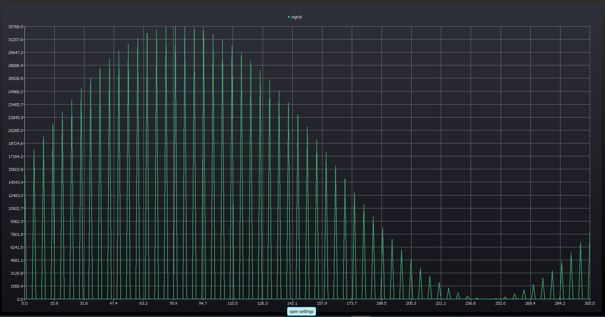

# Hi there , I'm Aleksei Lashko

<!--

"https://www.google.com/
src="https://img.icons8.com/color/344/telegram-app--v1.png"
**LASHKOAG/LASHKOAG** is a ✨ _special_ ✨ repository because its `README.md` (this file) appears on your GitHub profile.

Here are some ideas to get you started:

- 🔭 I’m currently working on ...
- 🌱 I’m currently learning ...
- 👯 I’m looking to collaborate on ...
- 🤔 I’m looking for help with ...
- 💬 Ask me about ...
- 📫 How to reach me: ...
- 😄 Pronouns: ...
- ⚡ Fun fact: ...
-->

 

 
<h2 align="center">⚒️ Languages-Frameworks ⚒️</h2>
 

    
     
     

 

## 👓︎ 🔧 My Tech Stack

- **Platforms**: Desktop/Embedded App Development

- **Framework**: Qt C++ | Qt Widgets | Qt Quick/QML

- **Operating Systems**: Linux, Embedded Linux, FreeRTOS

- **ASTRA LINUX**: App Development

- **Languages**: C, C++, Bash, Python

- **UI/UX Design**: Qt Framework, QML

- **Framework for Stm32**: MBED, FreeRTOS, HAL

- **Databases**: PostgreSQL | SQLite

- **Hardware**: Arduino, ESP32, Stm32, Raspberry Pi, Yocto, Advantech and etc

- **3D Modeling**: Kompas-3D, SolidWorks

# Docs

- [AGK - IoT project](#agk---iot-project)
- [My own robotics classroom](#my-own-robotics-classroom)
- [Qml Charts - Digital signal processing(DSP)](#Qml-Charts---Digital-signal-processingDSP)

# AGK - IoT project
 

     

- **IoT project**: C, Embedded linux, Bash, Python, Sqlite, Raspberrypi, Zigbee
- **UI/UX Design**: No display, no GUI
- **Operating Systems**: Embedded Linux
- **Languages**: C, Bash, Python
- **Version Control**: Bitbucket
- **Databases**: SQLite
- **Hardware**: PLC(programmable logic controller: Advantech ADAM-3600), Industrial modem, RS485, RS232, COM-ports, Sensors(Lufft and etc), UMB-protocol, Nmea-protocol, Camera (foto/video), E-mail send data,  Zigbee 
- **Reverse engineering**

# My own robotics classroom

- **Educational project**: C, Arduino/Raspberrypi, Bash, Python, Electrical engineering
- **Languages**: C, pure C (for AVR)
- **Version Control**: GitHub
- **Hardware**: Arduino, Sensors, SPI, I2C, NRF24 and etc
- **Hardware**: Stm32 - HAL, MBED
- **Hardware**:LEGO Education MINDSTORMS
- **DIY**: create own mobile robots with students/pupil, PCB Etching
- **Participation in competitions**
- **RoboSport**

# Qml Charts - Digital signal processing(DSP)

- **UI/UX Design**: Qt Framework, QML
- **Platforms**: Desktop App Development for **ASTRA LINUX**
- **Aditionally**: MATLAB coding

